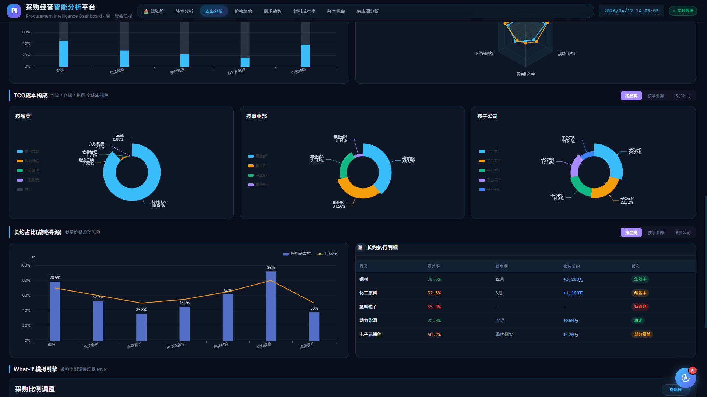

# 采购经营分析大屏 (Procurement Intelligence Dashboard)

面向采购总监的专业级数据可视化大屏，支持经营分析、降本追踪、支出洞察、价格趋势预测及 WhatIf 情景模拟。



## 核心功能

### 📊 八大分析模块

| Tab | 模块名称 | 核心功能 |
|-----|----------|----------|
| 🏠 Home | 驾驶舱总览 | 10个核心KPI、6条P0预警、双维度排名 |
| 1 | 降本分析 | 月度追踪、事业部/子公司对比、品类明细 |
| 2 | 支出分析 | 品类分布、价格偏差、VMI覆盖、TCO成本 |
| 3 | 价格趋势 | 实时预警、期货价格、宏观指标、锁价策略 |
| 4 | 需求预测 | 库存消耗、健康度、4周需求预测 |
| 5 | 材料成本率 | 多维度成本率分析、趋势对比 |
| 6 | 其他降本 | 长尾供应商整合、分散供应商分析 |
| 7 | 供应源分析 | 供应商绩效、集中度、单一供应风险 |

### 🎯 WhatIf 情景模拟器 (NEW)

**Tab 2 支出分析** 现已集成 **采购比例 WhatIf 模拟器**，支持实时情景测算。

#### 功能特性

- **场景模拟**: 调整现货/长约采购比例，即时计算成本影响
- **敏感性分析**: 乐观/基准/保守三档预测
- **风险识别**: 自动检测比例调整带来的业务风险
- **智能解释**: 生成四段式业务解读（结论/数据/风险/建议）
- **本地计算**: 无需后端，浏览器端实时响应

#### 使用方式

1. 进入 **Tab 2: 支出分析**
2. 在右侧面板找到 **"采购比例 WhatIf"** 区域
3. 调整参数：
   - 当前现货比例 → 目标现货比例
   - 现货价格 / 长约价格
   - 月采购量
4. 点击 **"运行模拟"**
5. 查看实时计算结果和业务建议

#### 技术实现

```
scenario-registry.js    # 场景配置定义
simulation-engine.js    # 本地计算引擎
risk-rules.js           # 业务风险规则
whatif-panel.js         # UI 面板控制器
template-explainer.js   # 解释生成器
```

#### 模拟示例

```javascript
// 输入参数
{
  currentSpotRatio: 0.6,   // 当前 60% 现货
  targetSpotRatio: 0.3,    // 目标 30% 现货
  currentSpotPrice: 5200,  // 现货价 5200元/吨
  contractPrice: 4800,     // 长约价 4800元/吨
  monthlyVolume: 10000     // 月采购 10000吨
}

// 输出结果
{
  monthlySavingWan: 12,      // 单月节约 12万元
  quarterlySavingWan: 36,    // 季度节约 36万元
  savingPercent: 7.7,        // 节约比例 7.7%
  risks: [...]              // 风险提示
}
```

## 技术栈

- **框架**: 原生 HTML/CSS/JavaScript
- **图表库**: ECharts 5.5
- **样式**: 深色科技风 (Dark Theme)
- **配色**: Cyan #38bdf8 / Gold #f59e0b / Green #10b981 / Red #ef4444
- **字体**: Inter (UI) + JetBrains Mono (数据)

## 项目结构

```
project_20260411_000342/projects/
├── index.html              # 主页面 (8 Tab + 37图表)
├── styles/
│   └── main.css           # 全局样式 + WhatIf 样式
├── assets/
│   ├── js/
│   │   ├── charts/        # 图表渲染模块
│   │   ├── ai/            # AI 助手功能
│   │   └── whatif/        # WhatIf 模拟器
│   │       ├── simulation-engine.js
│   │       ├── whatif-panel.js
│   │       ├── risk-rules.js
│   │       ├── scenario-registry.js
│   │       ├── formatter.js
│   │       └── explainers/
│   │           ├── template-explainer.js
│   │           └── ai-explainer.js
│   └── whatif-smoke-*.png # 冒烟测试截图
├── docs/
│   └── superpowers/
│       └── plans/
│           └── 2026-04-11-what-if-simulator.md
└── server/
    └── test/
        ├── whatif-foundation.test.js
        ├── whatif-simulation.test.js
        └── whatif-panel.test.js
```

## 本地运行

```bash
# 方式1: 直接打开
open project_20260411_000342/projects/index.html

# 方式2: 本地服务器
cd project_20260411_000342/projects
npx serve
# 访问 http://localhost:3000
```

## 测试

```bash
cd project_20260411_000342/projects/server

# 安装依赖
npm install

# 运行测试
npm test

# WhatIf 专项测试
npm test -- --grep "whatif"
```

## 设计规范

### 颜色系统

| 用途 | 颜色值 |
|------|--------|
| 主数据/正向 | Cyan `#38bdf8` |
| 警示/目标 | Gold `#f59e0b` |
| 达标/优化 | Green `#10b981` |
| 风险/缺口 | Red `#ef4444` |
| 背景 | `#0a0e1a` |
| 卡片背景 | `rgba(17,24,39,0.85)` |
| 边框 | `rgba(56,189,248,0.15)` |

### 响应式

- 设计基准: 1920px 宽度
- 适配大屏展示
- WhatIf 面板支持 1080px 以下单列布局

## 更新日志

### 2026-04-12

- ✨ **新增**: WhatIf 采购比例模拟器 (MVP)
- ✅ **测试**: 740行测试代码，覆盖率完整
- 📸 **资产**: 添加冒烟测试截图
- 🐛 **修复**: 浏览器 E2E 回归测试

### 2026-04-11

- 🎨 **重构**: v3.0 JS架构优化
- 🤖 **新增**: AI 助手浮层集成
- 📊 **新增**: 维度切换功能 (品类/BU/子公司)
- 🏠 **新增**: 首页驾驶舱 + P0预警系统

## 数据说明

本项目为 **演示Demo**，所有数据均为模拟数据，用于展示交互效果和视觉设计。实际部署时需替换为真实API数据接口。

## 文档

- [WhatIf 模拟器设计文档](./project_20260411_000342/projects/docs/superpowers/plans/2026-04-11-what-if-simulator.md)
- [需求追踪矩阵](./docs/dashboard-phase1-traceability-matrix.md)
- [技术规范](./docs/dashboard-phase1-tech.md)

## 许可证

MIT License

---

**采购经营分析大屏** - 让数据驱动采购决策 🚀
